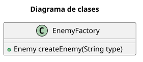

# Patrones
## Creacionales
### Factory
```java
  EnemyFactory enemyFactory = new EnemyFactory();
  Enemy warrior = enemyFactory.createEnemy("warrior");
  Enemy mage = enemyFactory.createEnemy("mage");
```
```java
public class EnemyFactory {
    public Enemy createEnemy(String type) {
        if(type.equalsIgnoreCase("warrior"))
            return new Warrior();
        else if(type.equalsIgnoreCase("mage"))
            return new Mage();
        else
            return null;
    }
}
```
Diagrama: 

### Factory Method
```java
 Enemy warrior = new WarriorFactory().createEnemy();
 Enemy mage = new MageFactory().createEnemy();
```
```java
public abstract class EnemyFactory {
    public abstract Enemy createEnemy();
}
```
```java
public class WarriorFactory extends EnemyFactory{
    @Override
    public Enemy createEnemy() {
        return new Warrior();
    }
}
public class MageFactory extends EnemyFactory{
    @Override
    public Enemy createEnemy() {
        return new Mage();
    }
}
```


  
